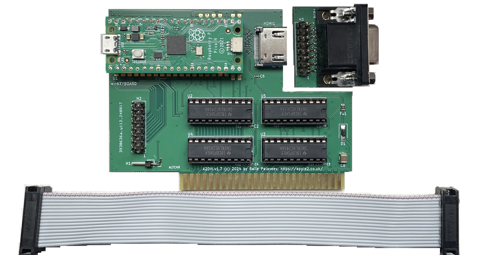
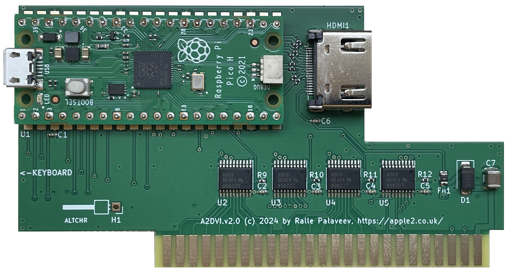
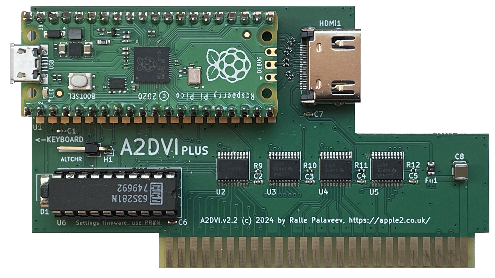

# A2DVI - Apple II Digital Video

This is a project for a digital DVI/HDMI Apple II video card.
It directly produces a digital video stream from Apple II's memory content.
The signal is output via an HDMI connector, connecting the Apple II to modern displays with HDMI (or DVI) inputs.
No more analog signal conversion required.

The project is a collaboration with Thorsten Brehm. His related firmware project is here: https://github.com/ThorstenBr/A2DVI-Firmware

For the DVI output to be active, the new firmware developed by Thorsten should be used.

The card also has an alternative analog VGA connector.
For the VGA output to be active, the [VGA firmware](https://github.com/markadev/AppleII-VGA) developed by Mark Aikens should be used.

The card can produce either an analog VGA or a digital HDMI signal, but not both simultaneously.
To switch between modes, a firmware update is required and opening/closing connections.

## Procedure to activate DVI mode
* v1.2:
  program [A2DVI-Firmware](https://github.com/ThorstenBr/A2DVI-Firmware) to RPI Pico;
  remove U6 and disconnect pins 11, 12 and 13 of U5.
* v1.5:
  program [A2DVI-Firmware](https://github.com/ThorstenBr/A2DVI-Firmware) to RPI Pico;
  open all 9 DIP switches.
* v1.6:
  program [A2DVI-Firmware](https://github.com/ThorstenBr/A2DVI-Firmware) to RPI Pico;
  desloder the 8 soldering pads at GPIOs 14-21.
* v1.7:
  program [A2DVI-Firmware](https://github.com/ThorstenBr/A2DVI-Firmware) to RPI Pico;
  desloder the 8 soldering pads at GPIOs 14-21; remove VGA sub-board and ribbon cable.
* v2.0:
  program [A2DVI-Firmware](https://github.com/ThorstenBr/A2DVI-Firmware) to RPI Pico.
* v2.2:
  program [A2DVI-Firmware](https://github.com/ThorstenBr/A2DVI-Firmware) to RPI Pico.
  
## Procedure to activate VGA mode
* v1.2:
  program [VGA firmware](https://github.com/markadev/AppleII-VGA) to RPI Pico;
  replace U5 and U6.
* v1.5:
  program [VGA firmware](https://github.com/markadev/AppleII-VGA) to RPI Pico;
  close all 9 DIP switches.
* v1.6:
  program [VGA firmware](https://github.com/markadev/AppleII-VGA) to RPI Pico;
  sloder the 8 soldering pads at GPIOs 14-21.
* v1.7:
  program [VGA firmware](https://github.com/markadev/AppleII-VGA) to RPI Pico;
  sloder the 8 soldering pads at GPIOs 14-21; connect VGA sub-board to main board by the ribbon cable.
* v2.0:
  N.A. - v2.0 is HDMI only.
* v2.2:
  N.A. - v2.0 is HDMI only.
  
## Dual-Language Support
The pin on the v1.5 and later boards is for AltChr connection, supported by A2DVI firmware for switching between alternative character sets on non-US versions of Apple II ("Euro-machines").

# Hardware
* Based on the PICO controller board.
* Provides a DVI video stream via an HDMI connector.
* Low power/heat dissipation: less than 70mA@5V = 0.35W in operation.
* Uses 4x 74LV245 bus transceivers for 5V/3.3V signal conversion of the Apple II bus.
* Separate ALTCHR input pin for dual-language support: pin needs to be wired separately to the "language switch" of Euro-Apple IIs (optional).

# Thanks
This is a project based on:

* the AppleII-VGA project by Mark Aikens - https://github.com/markadev/AppleII-VGA

* the PicoDVI project by Luke Wren - https://github.com/Wren6991/PicoDVI

* Thorsten Brehm for firmware development and board design considerations

* Oliver Schmidt on original idea discussions and design considerations

# License
Board design by Ralle Palaveev (c) 2024.

All rights reserved.

Redistribution and use in source, binary, and manufactured forms, with or without
modification, are permitted provided that the following conditions are met:
1. Redistributions of source code and design files must retain the above copyright
   notice, this list of conditions and the following disclaimer.
2. Redistributions in binary or manufactured form must reproduce the above copyright
   notice, this list of conditions and the following disclaimer in the
   documentation and/or other materials provided with the distribution.
3. All advertising materials mentioning features or use of this software
   or hardware must display the following acknowledgement:
   This product includes software or hardware developed by Ralle Palaveev.
4. Neither the name of Ralle Palaveev nor the
   names of its contributors may be used to endorse or promote products
   derived from this software or hardware without specific prior written permission.

The above copyright notice and this permission notice shall be included in all
copies or substantial portions of the Software.

THE SOFTWARE IS PROVIDED "AS IS", WITHOUT WARRANTY OF ANY KIND, EXPRESS OR
IMPLIED, INCLUDING BUT NOT LIMITED TO THE WARRANTIES OF MERCHANTABILITY,
FITNESS FOR A PARTICULAR PURPOSE AND NONINFRINGEMENT. IN NO EVENT SHALL THE
AUTHORS OR COPYRIGHT HOLDERS BE LIABLE FOR ANY CLAIM, DAMAGES OR OTHER
LIABILITY, WHETHER IN AN ACTION OF CONTRACT, TORT OR OTHERWISE, ARISING FROM,
OUT OF OR IN CONNECTION WITH THE SOFTWARE OR THE USE OR OTHER DEALINGS IN THE
SOFTWARE.
